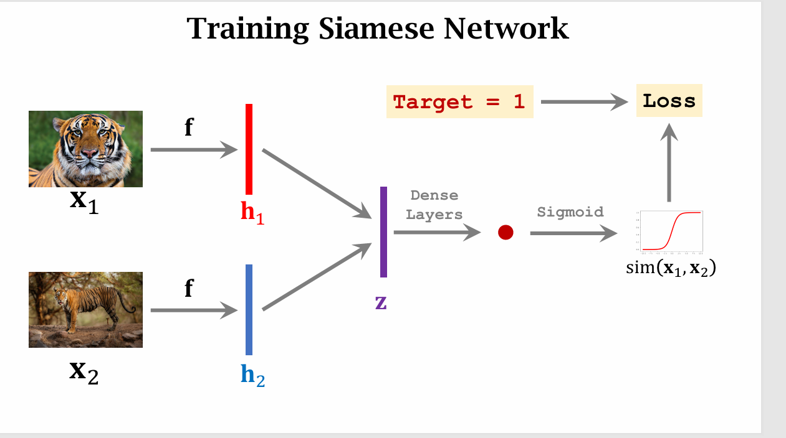
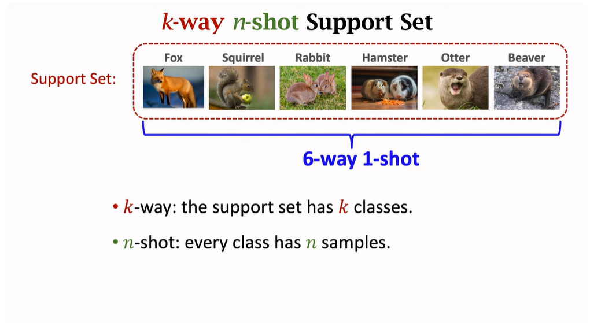
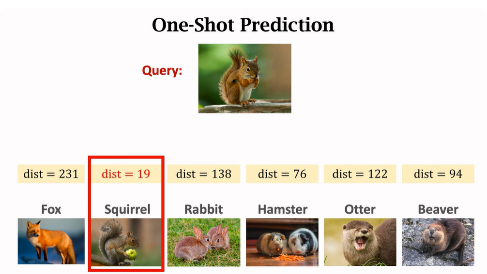
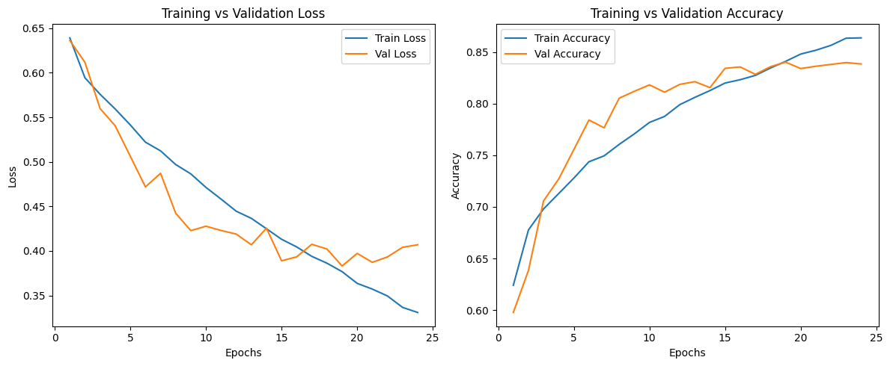
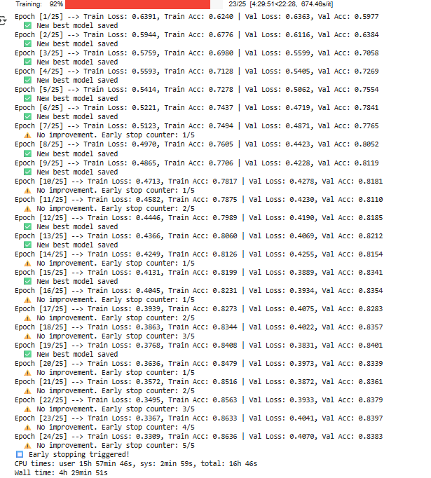

# 🧠 One-Shot Learning on CIFAR-100

This project explores **one-shot learning** using the CIFAR-100 dataset.  
The objective is to train a model that can generalize to unseen classes with only a single example per class.

---

## 🎯 Project Objective
- Implement one-shot learning with the **CIFAR-100 dataset**.
- Train a model to determine whether **two images belong to the same class** (binary classification: `0 = different`, `1 = same`).
- Use the trained model to classify queries by comparing them with a **support set** containing one example per class.

---

## 📚 Dataset
- **CIFAR-100**: [torchvision.datasets.CIFAR100](https://pytorch.org/vision/stable/generated/torchvision.datasets.CIFAR100.html)  
- Contains 100 image classes with 600 images each (500 training, 100 testing).  
- In this project:
  - Classes are divided into **seen classes** (used for training/validation) and **unseen classes** (used for one-shot testing).  


---

## 🏗️ Network Model
- **Base Model**: ResNet-18 (pretrained on ImageNet).  
- **Fine-tuning strategy**:
  - Layers `conv1` → `layer3` are **frozen**.  
  - Only **`layer4` and the fully connected head** are unfrozen and trained.  
- **Output**: A binary classifier predicting if a pair of images belong to the same class.  

---

## ⚙️ Methodology

1. **Data Preparation**  
   - Downloaded **CIFAR-100 training and test sets**, then concatenated them.  
   - Split classes into:
     - **Seen classes** → used for training/validation.  
     - **Unseen classes** → used for one-shot evaluation.  

2. **Pair Generation**  
   - Created pairs of images:  
     - **Positive pairs (label = 1):** two images from the same class.  
     - **Negative pairs (label = 0):** two images from different classes.  
   - Balanced dataset by generating equal numbers of positive and negative pairs.  
   - Ensured each class appears in negative pairs.  

3. **Dataloader**  
   - Provides:
     - **Training pairs** (seen classes).  
     - **Validation pairs** (seen classes).  
     - **Support + query sets** (unseen classes).  

4. **Training**  
   - Input: image pairs.  
   - Output: binary classification (`same / different`).  
   - **Loss function**: Binary Cross-Entropy Loss (BCE).  

5. **One-Shot Evaluation**  
   - For unseen classes:
     - Select **1 image per class** as the **support set**.  
     - Use the remaining images as **queries**.  
     - Classify queries by comparing them against the support set.  

---

## 🔗 Siamese Network Connection
Although not explicitly implemented as a Siamese network, the **pair-based binary classification** setup is equivalent in spirit:
- Model compares **two embeddings** and predicts similarity.  
- In Siamese form, this would be:
  - Shared ResNet18 encoder → Embeddings → Similarity score.  
- Loss function here: **Binary Cross-Entropy**, instead of contrastive loss.  
\
\
\

---

## 🧪 Additional Notes
- Learn more: [An Introduction to Few-Shot Learning](https://www.analyticsvidhya.com/blog/2021/05/an-introduction-to-few-shot-learning/)  
- Try different dataset splits:
  - **90-10**
  - **80-20**
  - **50-50**
  - etc.

---

## 🗂️ Code Explanation

### `data_utils.py`

This file handles **data preparation** for the one-shot learning project.

#### `prepare_data()`
- Prepares datasets and returns **train/validation loaders** for seen classes and a **test dataset** for unseen classes.
- Handles splitting, pair generation, and creating PyTorch dataloaders.

##### Example Usage:

```python
from data_utils import prepare_data

train_loader, val_loader, test_dataset = def prepare_data(root, num_training_classes, pos_num_pairs, neg_num_pairs, batch_size, img_size=224):
```

### `models.py`

This file defines the **Siamese Network** for one-shot learning using ResNet-18 as a backbone.

#### `SiameseResNet()`
- Creates a **Siamese Network** that takes **two input images** and predicts **similarity** (0 = different class, 1 = same class).  
- Only **`layer4` + fully connected head** are trainable, the rest of ResNet-18 is frozen.  
- Outputs a similarity score after computing the **absolute difference** of embeddings.

##### Example Usage:

```python
from models import SiameseResNet
import torch

model = SiameseResNet()
model.freeze_until(layer_num=4) # default will freeze all layers 
```

### `train.py`

This file handles the **training loop** for the Siamese network.

#### `train(model, train_loader, valid_loader, optimizer, loss_fn, device, epochs=100, patience=10, writer=None)`
- Trains the **SiameseResNet** model on the training dataset.  
- Validates on the **validation dataset** at each epoch.  
- Uses **early stopping** with `patience` to prevent overfitting.  
- Optionally logs metrics to **TensorBoard** using `writer`.  

##### Example Usage:

```python

from train import train

train(model, train_loader, val_loader, optimizer, loss_fn, device, epochs=50, patience=5, writer=writer)
```

### `helper_functions.py`

This file contains **helper functions** for visualization and debugging, such as plotting images, pairs, and predictions.


## 🔬 Experiment

### First Experiment

**Dataset & Setup:**
- Seen classes: 90  
- Number of pairs per class: 250 positive + 250 negative  
- Total pairs generated for training: 44,977  
- Number of epochs: 25  
- Early stopping patience: 5  
- Wall time: 4h 29min 51s  

---

### Training Results

**1. Accuracy and Loss Curves**

  
*Figure 1: Training and validation accuracy/loss over epochs.*

**2. Epoch-wise Training Details**

  
*Figure 2: Epoch-wise log showing train and validation loss and accuracy.*

| Epoch | Train Loss | Train Acc | Val Loss | Val Acc | Notes |
|-------|-----------|-----------|----------|---------|-------|
| 1     | 0.6391    | 0.6240    | 0.6363   | 0.5977  | ✅ New best model |
| 2     | 0.5944    | 0.6776    | 0.6116   | 0.6384  | ✅ New best model |
| 3     | 0.5759    | 0.6980    | 0.5599   | 0.7058  | ✅ New best model |
| 4     | 0.5593    | 0.7128    | 0.5405   | 0.7269  | ✅ New best model |
| 5     | 0.5414    | 0.7278    | 0.5062   | 0.7554  | ✅ New best model |
| ...   | ...       | ...       | ...      | ...     | ... |
| 24    | 0.3309    | 0.8636    | 0.4070   | 0.8383  | ⚠️ Early stop counter 5/5 |
| 25    | -         | -         | -        | -       | ⏹️ Early stopping triggered |

---

### Observations
- Training accuracy steadily increased, while validation accuracy closely followed, indicating good generalization.  
- Validation loss occasionally lower than training loss, likely due to dropout and data augmentation during training.  
- Early stopping was triggered at epoch 24, saving the best model at epoch 19.  
- Loss curves indicate convergence before the maximum number of epochs.

---


