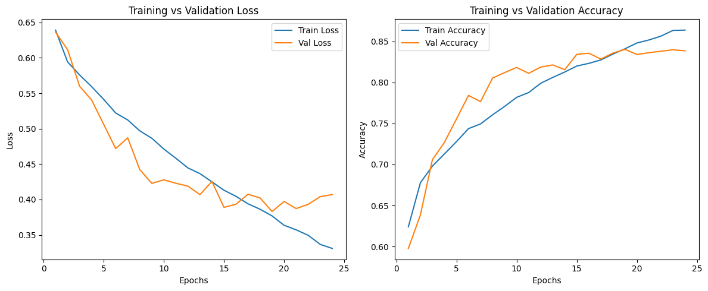
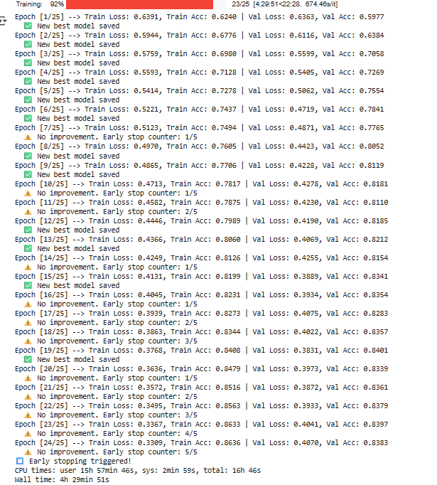
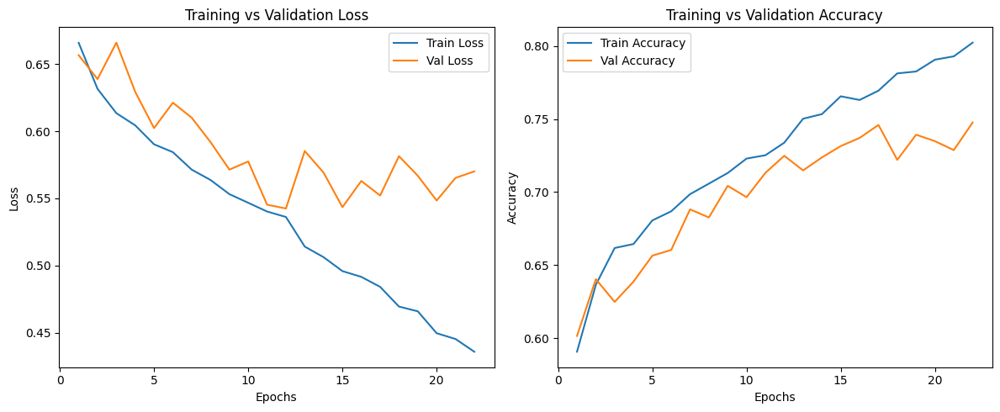
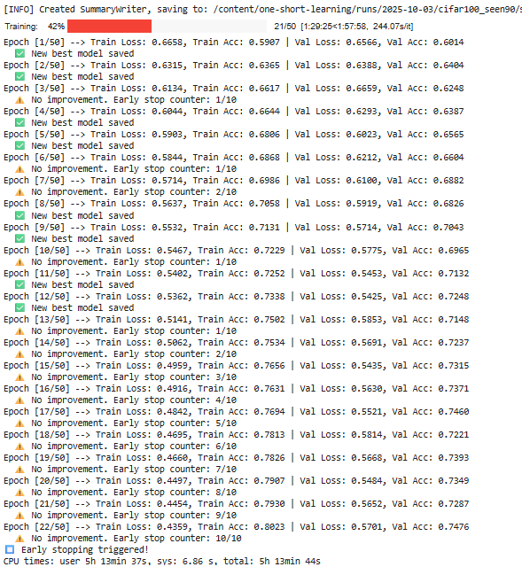
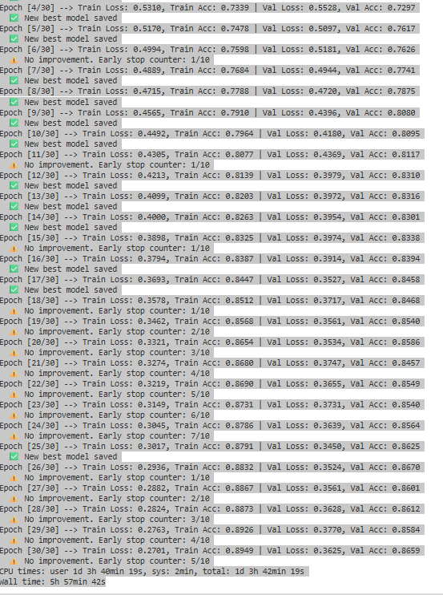
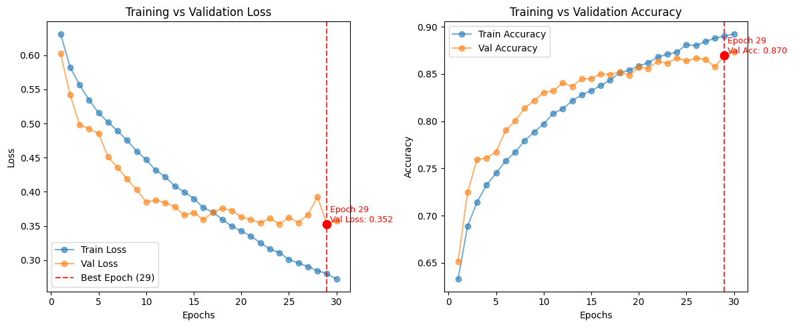
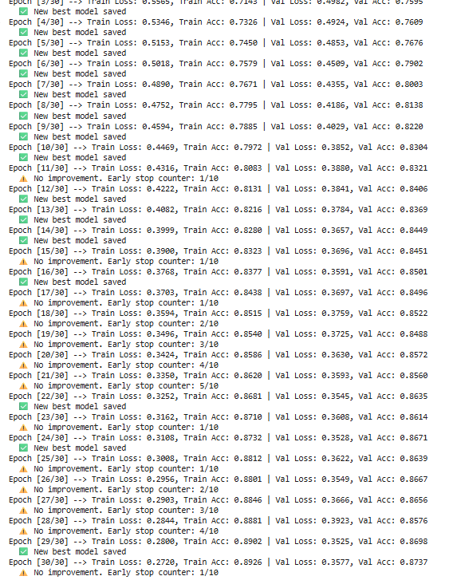
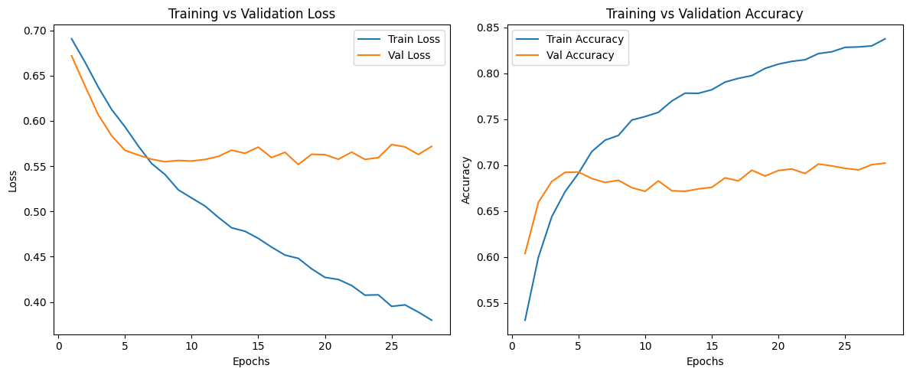
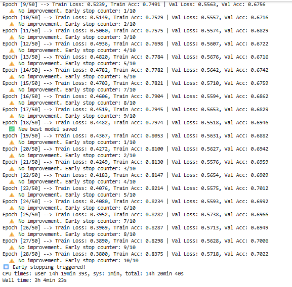

# 🧠 One-Shot Learning on CIFAR-100

This project explores **one-shot learning** using the CIFAR-100 dataset.  
The objective is to train a model that can generalize to unseen classes with only a single example per class.

---

## 🎯 Project Objective
- Implement one-shot learning with the **CIFAR-100 dataset**.
- Train a model to determine whether **two images belong to the same class** (binary classification: `0 = different`, `1 = same`).
- Use the trained model to classify queries by comparing them with a **support set** containing one example per class.

---

## 📚 Dataset
- **CIFAR-100**: [torchvision.datasets.CIFAR100](https://pytorch.org/vision/stable/generated/torchvision.datasets.CIFAR100.html)  
- Contains 100 image classes with 600 images each (500 training, 100 testing).  
- In this project:
  - Classes are divided into **seen classes** (used for training/validation) and **unseen classes** (used for one-shot testing).  


---

## 🏗️ Network Model
- **Base Model**: ResNet-18 (pretrained on ImageNet).  
- **Fine-tuning strategy**:
  - Layers `conv1` → `layer3` are **frozen**.  
  - Only **`layer4` and the fully connected head** are unfrozen and trained.  
- **Output**: A binary classifier predicting if a pair of images belong to the same class.  

---

## ⚙️ Methodology

1. **Data Preparation**  
   - Downloaded **CIFAR-100 training and test sets**, then concatenated them.  
   - Split classes into:
     - **Seen classes** → used for training/validation.  
     - **Unseen classes** → used for one-shot evaluation.  

2. **Pair Generation**  
   - Created pairs of images:  
     - **Positive pairs (label = 1):** two images from the same class.  
     - **Negative pairs (label = 0):** two images from different classes.  
   - Balanced dataset by generating equal numbers of positive and negative pairs.  
   - Ensured each class appears in negative pairs.  

3. **Dataloader**  
   - Provides:
     - **Training pairs** (seen classes).  
     - **Validation pairs** (seen classes).  
     - **Support + query sets** (unseen classes).  

4. **Training**  
   - Input: image pairs.  
   - Output: binary classification (`same / different`).  
   - **Loss function**: Binary Cross-Entropy Loss (BCE).  

5. **One-Shot Evaluation**  
   - For unseen classes:
     - Select **1 image per class** as the **support set**.  
     - Use the remaining images as **queries**.  
     - Classify queries by comparing them against the support set.  

---
## 🔗 Siamese Network Concept

A **Siamese network** is a special type of model that learns to **compare two inputs** instead of classifying just one.

- It has **two identical branches** (sharing the same weights) — usually the same CNN such as **ResNet18**.  
- Each branch extracts **features (embeddings)** from its input image.  
- The model then **measures how similar** the two embeddings are (for example, by computing their distance).  
- If the distance is small → the images are from the **same class**,  
  if large → they are from **different classes**.  

### In This Project
- We use **paired images** (two inputs at a time).  
- The model learns to predict whether the pair is **same or different**.  
- This is effectively **Siamese learning**, even though it’s implemented as a **binary classifier**.   
\
\
\

---

## 🧪 Additional Notes
- Learn more: [An Introduction to Few-Shot Learning](https://www.analyticsvidhya.com/blog/2021/05/an-introduction-to-few-shot-learning/)  
- Try different dataset splits:
  - **90-10**
  - **80-20**
  - **50-50**
  - etc.

---

## 🗂️ Code Explanation

### `data_utils.py`

This file handles **data preparation** for the one-shot learning project.

#### `prepare_data()`
- Prepares datasets and returns **train/validation loaders** for seen classes and a **test dataset** for unseen classes.
- Handles splitting, pair generation, and creating PyTorch dataloaders.

##### Example Usage:

```python
from data_utils import prepare_data

train_loader, val_loader, test_dataset = def prepare_data(root, num_training_classes, pos_num_pairs, neg_num_pairs, batch_size, img_size=224):
```

### `models.py`

This file defines the **Siamese Network** for one-shot learning using ResNet-18 as a backbone.

#### `SiameseResNet()`
- Creates a **Siamese Network** that takes **two input images** and predicts **similarity** (0 = different class, 1 = same class).  
- Only **`layer4` + fully connected head** are trainable, the rest of ResNet-18 is frozen.  
- Outputs a similarity score after computing the **absolute difference** of embeddings.

##### Example Usage:

```python
from models import SiameseResNet

model = SiameseResNet()
model.freeze_until(layer_num=4) # default will freeze all layers 
```

### `train.py`

This file handles the **training loop** for the Siamese network.

#### `train(model, train_loader, valid_loader, optimizer, loss_fn, device, epochs=100, patience=10, writer=None)`
- Trains the **SiameseResNet** model on the training dataset.  
- Validates on the **validation dataset** at each epoch.  
- Uses **early stopping** with `patience` to prevent overfitting.  
- Optionally logs metrics to **TensorBoard** using `writer`.  

##### Example Usage:

```python

from train import train

train(model, train_loader, val_loader, optimizer, loss_fn, device, epochs=50, patience=5, writer=writer)
```

### `helper_functions.py`

This file contains **helper functions** for visualization and debugging, such as plotting images, pairs, and predictions.


## 🔬 Experiment

### First Experiment

**Dataset & Setup:**
- Seen classes: 90  
- Number of pairs per class: 250 positive + 250 negative  
- Total pairs generated for training: 44,977  
- Number of epochs: 25  
- Early stopping patience: 5  
- Wall time: 4h 29min 51s  

---

### Training Results

**1. Accuracy and Loss Curves**

  
*Figure 1: Training and validation accuracy/loss over epochs.*

**2. Epoch-wise Training Details**

  
*Figure 2: Epoch-wise log showing train and validation loss and accuracy.*
---

### Best Model Summary

| Metric | Best Epoch | Train | Validation |
|:-------|:------------:|:-------:|:------------:|
| **Loss** | 19 | **0.3768** | **0.3831** |
| **Accuracy** | 19 | **0.8408** | **0.8401** |

---
[RESULT] Few-shot accuracy: 0.3329
---

### Second Experiment

**Model & Setup:**
- Backbone: **ResNet18 (last block unfrozen)**  
- Loss: **BCEWithLogits**  
- Image size: **224** (resized)  
- Seen classes: **90**  
- Number of pairs per class: **100 positive + 100 negative**  
- Total pairs generated for training: **17,998**  
- Number of epochs: **50**  
- Early stopping patience: **10**  
- Wall time: **1h 29min 25s** 

---

#### Training Results

**1. Accuracy and Loss Curves**

  
*Figure 1: Training and validation accuracy/loss over epochs.*

**2. Epoch-wise Training Details**

  
*Figure 2: Epoch-wise log showing train and validation loss and accuracy.*

---
### Best Model Summary

| Metric | Best Epoch | Train | Validation |
|:-------|:------------:|:-------:|:------------:|
| **Loss** | 12 | **0.5362** | **0.5425** |
| **Accuracy** | 12 | **0.7338** | **0.7248** |

---
**[RESULT] Few-shot accuracy: 0.3888**
---


### Third Experiment

**Model & Setup:**
- Model: ResNet18 (Layer 4 Unfrozen) + BCEWithLogits  
- Image Size: 224  
- Seen Classes: 90  
- Number of pairs per class: 300 positive + 300 negative  
- Total pairs generated for training: 53,979  
- Number of epochs: 30  
- Early stopping patience: 10  
- Wall time: 5h 57min 42s  

---

### Training Results

**1. Accuracy and Loss Curves**

  
*Figure 3: Training and validation accuracy/loss over epochs with the best epoch marked.*

**2. Epoch-wise Training Details**

  
*Figure 4: Epoch-wise log showing train and validation loss and accuracy progression.*

---

### Best Model Summary

| Metric | Best Epoch | Train | Validation |
|:-------|:------------:|:-------:|:------------:|
| **Loss** | 25 | 0.3017 | **0.3450** |
| **Accuracy** | 25 | 0.8791 | **0.8625** |
---
**[RESULT] Few-shot accuracy: 0.3693**
---

### fourth Experiment 

**Model & Setup:**
- Model: ResNet18 + BCEWithLogits  
- Image Size: 224  
- Seen Classes: 80  
- Number of pairs per class: 350 positive + 350 negative  
- Total pairs generated for training: 55,970  
- Number of epochs: 30  
- Early stopping patience: 10 
- Wall time: 6h 30min 25s   

---

### Training Results

**1. Accuracy and Loss Curves**

  
*Figure 5: Training and validation accuracy/loss curves with the best epoch marked.*

**2. Epoch-wise Training Details**

  
*Figure 6: Epoch-wise log showing train and validation loss and accuracy progression.*

---

### Best Model Summary

| Metric | Best Epoch | Train | Validation |
|:-------|:------------:|:-------:|:------------:|
| **Loss** | 29 | 0.2800 | **0.3525** |
| **Accuracy** | 29 | 0.8902 | **0.8698** |

---

**[RESULT] Few-shot accuracy: 0.2902**

---

### Fifth Experiment

**Model & Setup:**
- Model: Siamese CNN + Contrastive Loss  
- Image Size: 32 (original)  
- Seen Classes: 50  
- Number of pairs per class: 300 positive + 300 negative  
- Total pairs generated for training: 29,994  
- Number of epochs: 50  
- Early stopping patience: 10  
- Wall time: 3h 4min 23s  

---

### Training Results

**1. Accuracy and Loss Curves**

*(Replace with actual plot if available)*  

  
*Figure 7: Training and validation accuracy/loss curves with the best epoch marked.*

**2. Epoch-wise Training Details**

*(Optional: you can include a table or image from your logs)*  

  
*Figure 8: Epoch-wise log showing train and validation loss and accuracy progression.*

---

### Best Model Summary

| Metric | Best Epoch | Train | Validation |
|:-------|:-----------:|:------:|:----------:|
| **Loss** | 18 | 0.4482 | **0.5518** |
| **Accuracy** | 18 | 0.7974 | **0.6946** |

---

**[RESULT] Few-shot accuracy: —**  


