# 🧠 One-Shot Learning on CIFAR-100

This project explores **one-shot learning** using the CIFAR-100 dataset.  
The objective is to train a model that can generalize to unseen classes with only a single example per class.

---

## 🎯 Project Objective
- Implement one-shot learning with the **CIFAR-100 dataset**.
- Train a model to determine whether **two images belong to the same class** (binary classification: `0 = different`, `1 = same`).
- Use the trained model to classify queries by comparing them with a **support set** containing one example per class.

---

## 📚 Dataset
- **CIFAR-100**: [torchvision.datasets.CIFAR100](https://pytorch.org/vision/stable/generated/torchvision.datasets.CIFAR100.html)  
- Contains 100 image classes with 600 images each (500 training, 100 testing).  
- In this project:
  - Classes are divided into **seen classes** (used for training/validation) and **unseen classes** (used for one-shot testing).  


---

## 🏗️ Network Model
- **Base Model**: ResNet-18 (pretrained on ImageNet).  
- **Fine-tuning strategy**:
  - Layers `conv1` → `layer3` are **frozen**.  
  - Only **`layer4` and the fully connected head** are unfrozen and trained.  
- **Output**: A binary classifier predicting if a pair of images belong to the same class.  

---

## ⚙️ Methodology

1. **Data Preparation**  
   - Downloaded **CIFAR-100 training and test sets**, then concatenated them.  
   - Split classes into:
     - **Seen classes** → used for training/validation.  
     - **Unseen classes** → used for one-shot evaluation.  

2. **Pair Generation**  
   - Created pairs of images:  
     - **Positive pairs (label = 1):** two images from the same class.  
     - **Negative pairs (label = 0):** two images from different classes.  
   - Balanced dataset by generating equal numbers of positive and negative pairs.  
   - Ensured each class appears in negative pairs.  

3. **Dataloader**  
   - Provides:
     - **Training pairs** (seen classes).  
     - **Validation pairs** (seen classes).  
     - **Support + query sets** (unseen classes).  

4. **Training**  
   - Input: image pairs.  
   - Output: binary classification (`same / different`).  
   - **Loss function**: Binary Cross-Entropy Loss (BCE).  

5. **One-Shot Evaluation**  
   - For unseen classes:
     - Select **1 image per class** as the **support set**.  
     - Use the remaining images as **queries**.  
     - Classify queries by comparing them against the support set.  

  
---
## 🔗 Siamese Network Concept

A **Siamese network** is a special type of model that learns to **compare two inputs** instead of classifying just one.

- It has **two identical branches** (sharing the same weights) — usually the same CNN such as **ResNet18**.  
- Each branch extracts **features (embeddings)** from its input image.  
- The model then **measures how similar** the two embeddings are (for example, by computing their distance).  
- If the distance is small → the images are from the **same class**,  
  if large → they are from **different classes**.  

### In This Project
- We use **paired images** (two inputs at a time).  
- The model learns to predict whether the pair is **same or different**.  
- This is effectively **Siamese learning**, even though it’s implemented as a **binary classifier**.   
\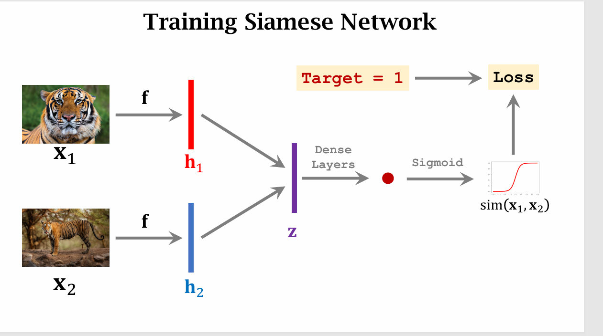
\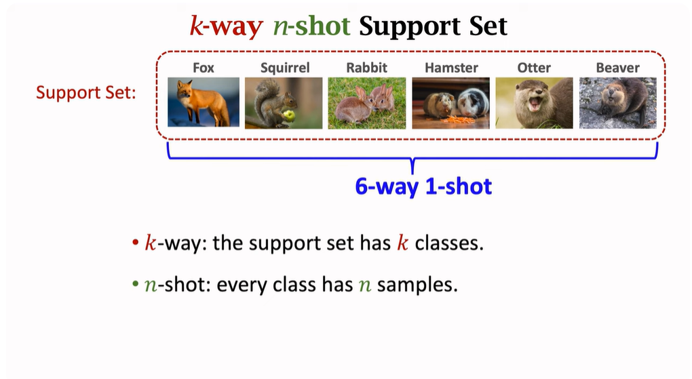
\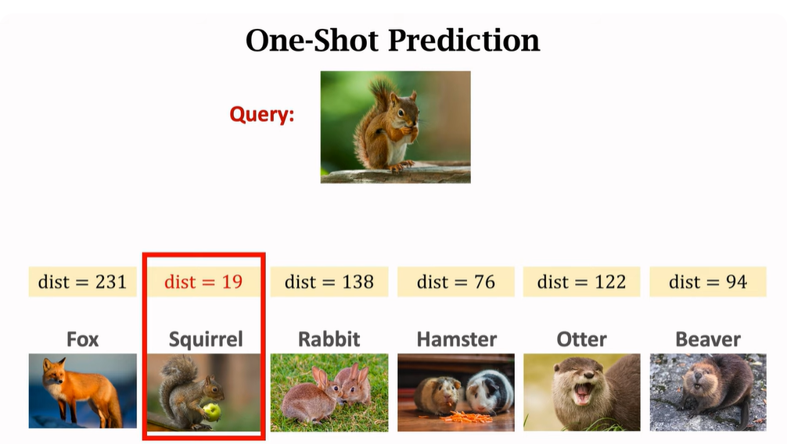

---

## 🧪 Additional Notes
- Learn more: [An Introduction to Few-Shot Learning](https://www.analyticsvidhya.com/blog/2021/05/an-introduction-to-few-shot-learning/)  
- Try different dataset splits:
  - **90-10**
  - **80-20**
  - **50-50**
  - etc.

---

## 🗂️ Code Explanation

### `data_utils.py`

This file handles **data preparation** for the one-shot learning project.

#### `prepare_data()`
- Prepares datasets and returns **train/validation loaders** for seen classes and a **test dataset** for unseen classes.
- Handles splitting, pair generation, and creating PyTorch dataloaders.

##### Example Usage:

```python
from data_utils import prepare_data

train_loader, val_loader, test_dataset = def prepare_data(root, num_training_classes, pos_num_pairs, neg_num_pairs, batch_size, img_size=224):
```

### `models.py`

This file defines the **Siamese Network** for one-shot learning using ResNet-18 as a backbone.

#### `SiameseResNet()`
- Creates a **Siamese Network** that takes **two input images** and predicts **similarity** (0 = different class, 1 = same class).  
- Only **`layer4` + fully connected head** are trainable, the rest of ResNet-18 is frozen.  
- Outputs a similarity score after computing the **absolute difference** of embeddings.

##### Example Usage:

```python
from models import SiameseResNet

model = SiameseResNet()
model.freeze_until(layer_num=4) # default will freeze all layers 
```

### `train.py`

This file handles the **training loop** for the Siamese network.

#### `train(model, train_loader, valid_loader, optimizer, loss_fn, device, epochs=100, patience=10, writer=None)`
- Trains the **SiameseResNet** model on the training dataset.  
- Validates on the **validation dataset** at each epoch.  
- Uses **early stopping** with `patience` to prevent overfitting.  
- Optionally logs metrics to **TensorBoard** using `writer`.  

##### Example Usage:

```python

from train import train

train(model, train_loader, val_loader, optimizer, loss_fn, device, epochs=50, patience=5, writer=writer)
```

### `helper_functions.py`

This file contains **helper functions** for visualization and debugging, such as plotting images, pairs, and predictions.


## 🔬 Experiment

### First Experiment

**Description**:
- Model: Resnet18 + BCEWithLogits
- Image Size: 224
- Seen classes: 90
- Number of pairs per class: 300 positive + 300 negative
- Total pairs generated for training: 53979
- Number of epochs: 30
- Early stopping patience: 10
- Best epoch: Epoch [25/30] --> Train Loss: 0.3017, Train Acc: 0.8791 | Val Loss: 0.3450, Val Acc: 0.8625
- time: 5h 57min 42s

**Results**:
- Few-shot accuracy: 0.3693
- Distance-based Few-shot Accuracy: 0.3907
- Cosine similarity Few-shot Accuracy: 0.3830

---

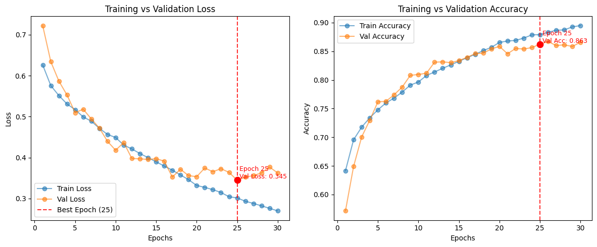  


### Second Experiment
#### First attempt


**Description**:
- Model: Resnet18 + BCEWithLogits
- Image Size: 224 (original)
- Seen classes: 90
- Number of pairs per class: 100 positive + 100 negative
- Total pairs generated for training: 17998
- Number of epochs: 50
- Early stopping patience: 10
- Best epoch: Epoch [12/50] --> Train Loss: 0.5362, Train Acc: 0.7338 | Val Loss: 0.5425, Val Acc: 0.7248
- time: 1h 29min 25s

**Results**:
- Few-shot accuracy: 0.3888
- Distance-based Few-shot Accuracy: 0.3731
- Cosine similarity Few-shot Accuracy: 0.4033
---
  

#### Second attempt

**Description**:
  - Model: Resnet18 + BCEWithLogits (freeze all layers)
  - Image Size: 224 (original)
  - Seen classes: 90
  - Number of pairs per class: 100 positive + 100 negative
  - Total pairs generated for training: 17998
  - Number of epochs: 50
  - Early stopping patience: 10
  - Best epoch: Epoch [43/50] --> Train Loss: 0.6046, Train Acc: 0.6629 | Val Loss: 0.5375, Val Acc: 0.7538
  - time: 3h 22min 43s

**Results**:
- Distance-based Few-shot Accuracy: 0.3978
- Cosine similarity Few-shot Accuracy: 0.4175

---
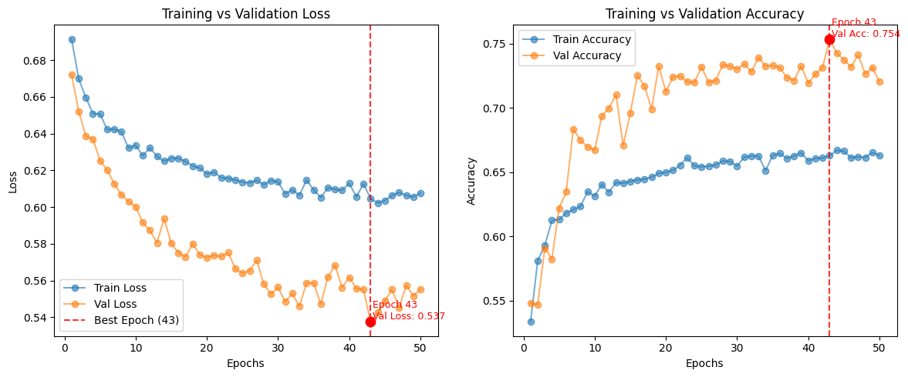  

### Third Experiment

#### First Attempt

**Description**
- Model: CNN  
- Image Size: 32 (original)  
- Seen classes: 90  
- Number of pairs per class: 400 positive + 400 negative  
- Total pairs generated for training: 71,956  
- Number of epochs: 100  
- Early stopping patience: 15  
- Best epoch: Epoch [84/150] → Train Loss: 0.4506, Train Acc: 0.7833 | Val Loss: 0.4717, Val Acc: 0.7742  
- Time: 4h 43min 41s  

**Results**
- Few-shot accuracy: 0.3083  
- Distance-based Few-shot Accuracy: 0.3175  
- Cosine similarity Few-shot Accuracy: 0.3603  

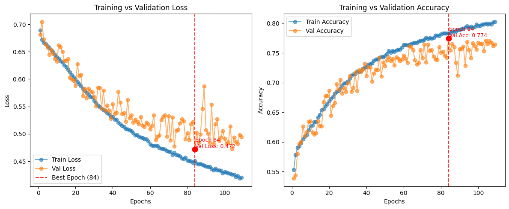  
---

#### Second Attempt

**Description**
- Model: CNN  
- Image Size: 32 (original)  
- Seen classes: 80  
- Number of pairs per class: 400 positive + 400 negative  
- Total pairs generated for training: 63,967  
- Number of epochs: 130  
- Early stopping patience: 15  
- Best epoch: Epoch [76/140] → Train Loss: 0.4540, Train Acc: 0.7804 | Val Loss: 0.4919, Val Acc: 0.7564  
- Time: 3h 29min 8s  

**Results**
- Few-shot accuracy: 0.2026  
- Distance-based Few-shot Accuracy: 0.2339  
- Cosine similarity Few-shot Accuracy: 0.2615  

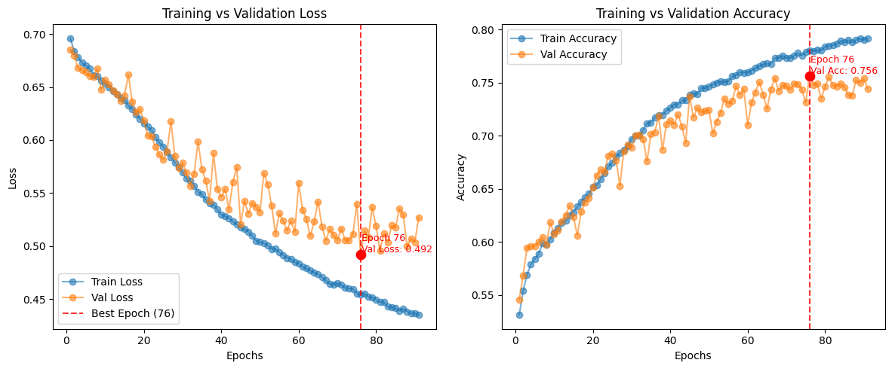  
---

#### Third Attempt

**Description**
- Model: CNN  
- Image Size: 32 (original)  
- Seen classes: 50  
- Number of pairs per class: 500 positive + 500 negative  
- Total pairs generated for training: 49,963  
- Number of epochs: 150  
- Early stopping patience: 20  
- Best epoch: Epoch [69/140] → Train Loss: 0.3887, Train Acc: 0.8206 | Val Loss: 0.4446, Val Acc: 0.7944  
- Time: 2h 29min 49s  

**Results**
- Few-shot accuracy: 0.0778  
- Distance-based Few-shot Accuracy: 0.0970  
- Cosine similarity Few-shot Accuracy: 0.1151  
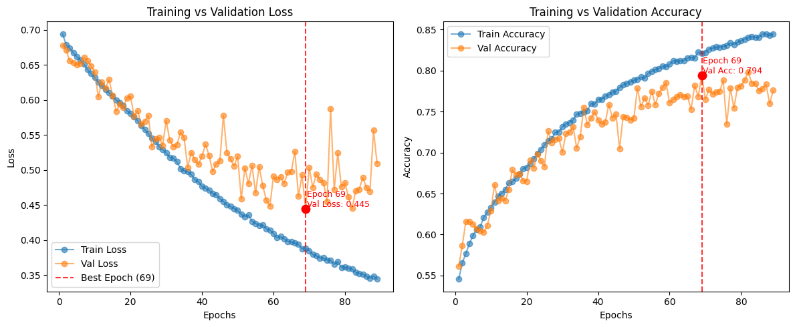  

---


### Fourth Experiment

**Description**
- Model: ResNet18 + BCEWithLogits  
- Image Size: 224  
- Seen classes: 80  
- Number of pairs per class: 350 positive + 350 negative  
- Total pairs generated for training: 55,970  
- Number of epochs: 30  
- Early stopping patience: 10  
- Best epoch: Epoch [29/30] → Train Loss: 0.2800, Train Acc: 0.8902 | Val Loss: 0.3525, Val Acc: 0.8698  
- Time: Unknown  

**Results**
- Few-shot accuracy: 0.2902  

  
---


### Fifth Experiment

#### First Attempt

**Description**
- Model: ResNet18 + Contrastive Loss  
- Image Size: 224  
- Seen classes: 80  
- Number of pairs per class: 100 positive + 100 negative  
- Total pairs generated for training: 15,999  
- Number of epochs: 30  
- Early stopping patience: 10  
- Best epoch: Training (Contrastive) → Epoch [24/30] → Train Loss: 0.4259, Train Acc: 0.6585 | Val Loss: 0.4115, Val Acc: 0.6954  
- Time: Unknown  

**Results**
- Few-shot accuracy (contrastive embeddings): 0.3132  

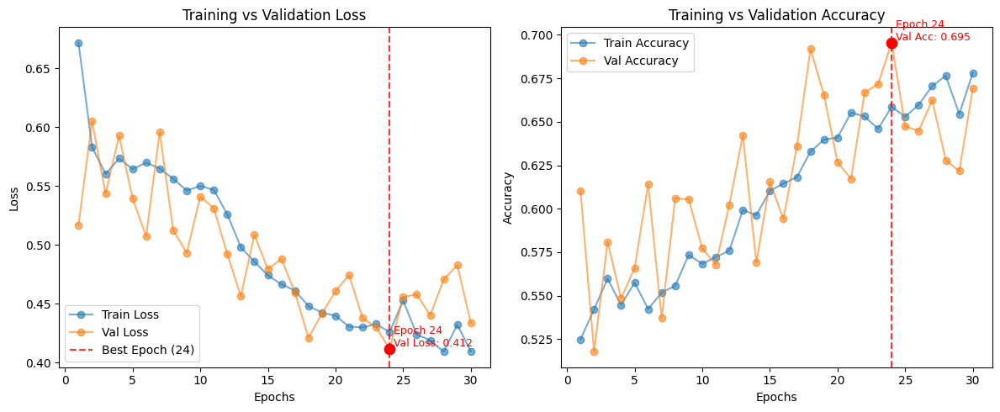  
---

#### Second Attempt

**Description**
- Model: CNN + Contrastive Loss  
- Image Size: 32  
- Seen classes: 90  
- Number of pairs per class: 300 positive + 300 negative  
- Total pairs generated for training: 53,973  
- Number of epochs: 120  
- Early stopping patience: 15  
- Best epoch: Training (Contrastive) → Epoch [118/120] → Train Loss: 0.3445, Train Acc: 0.7512 | Val Loss: 0.3483, Val Acc: 0.7404  
- Time: Unknown  

**Results**
- Distance-based Few-shot Accuracy: 0.3132  
- Cosine similarity Few-shot Accuracy: 0.3284  


---

## Summary of Experimental Results and Visualization
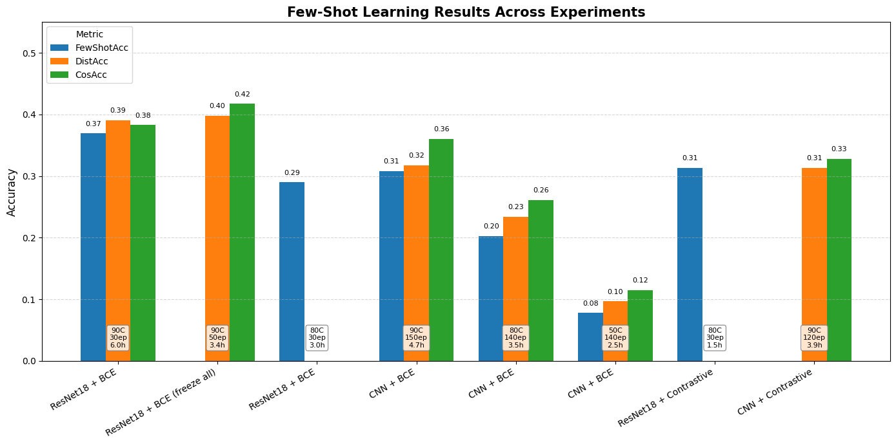

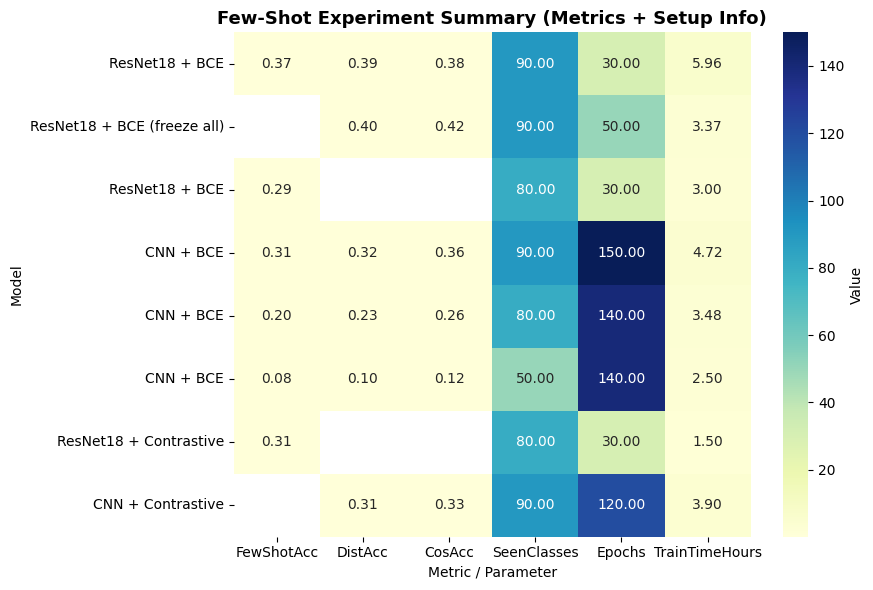


# The other experiments are on Google colab 
[Colab Notebook](https://colab.research.google.com/drive/1RgxpvsU5lU0Wn1ABU6-2hNBb6uyfdXOR#scrollTo=7c028mnfg_2w)